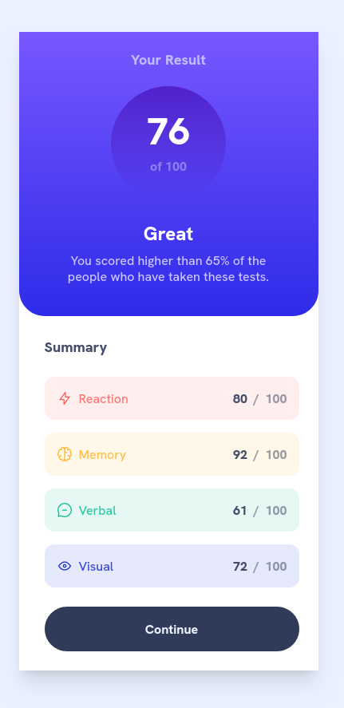
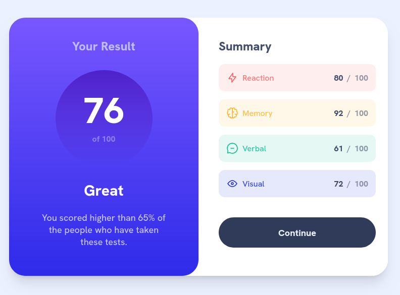
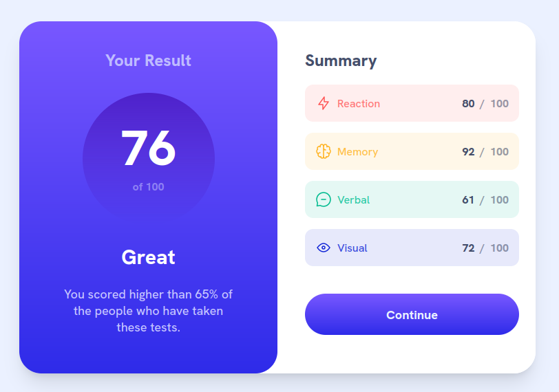

# Frontend Mentor - Results summary component solution

This is a solution to the [Results summary component challenge on Frontend Mentor](https://www.frontendmentor.io/challenges/results-summary-component-CE_K6s0maV). Frontend Mentor challenges help you improve your coding skills by building realistic projects.

## Table of contents

- [Overview](#overview)
  - [The challenge](#the-challenge)
  - [Screenshot](#screenshot)
  - [Links](#links)
- [My process](#my-process)
  - [Built with](#built-with)
  - [What I learned](#what-i-learned)
  - [Continued development](#continued-development)
  - [Useful resources](#useful-resources)
- [Author](#author)
- [Acknowledgments](#acknowledgments)

## Overview

### The challenge

Users should be able to:

- View the optimal layout for the interface depending on their device's screen size
- See hover and focus states for all interactive elements on the page

### Screenshot

### Links

- Solution URL: [Add solution URL here](https://github.com/CosteaAlin93/front-end-mentor-newbie-results-summary-component)
- Live Site URL: [Add live site URL here](https://costeaalin93.github.io/front-end-mentor-newbie-results-summary-component/)

## My process

### Built with

- HTML 5
- Tailwind CSS
- Flexbox

### What I learned

- Using custom color configuration in the tailwind.config
- Custom sizes in px instead of tailwind defauls
- Using gradients color on hover state

### Continued development

- Next step would be to add custom styles for the li items in the tailwind.config, to get rid of redundant code

### Useful resources

- [Tailwind Gradients](https://tailwindcss.com/docs/gradient-color-stops#basic-usage) - Tailwind's documentation on gradients

## Author

- Frontend Mentor - [@CosteaAlin93](https://www.frontendmentor.io/profile/CosteaAlin93)
- Twitter - [@AlinCostea93](https://www.twitter.com/AlinCostea93)
